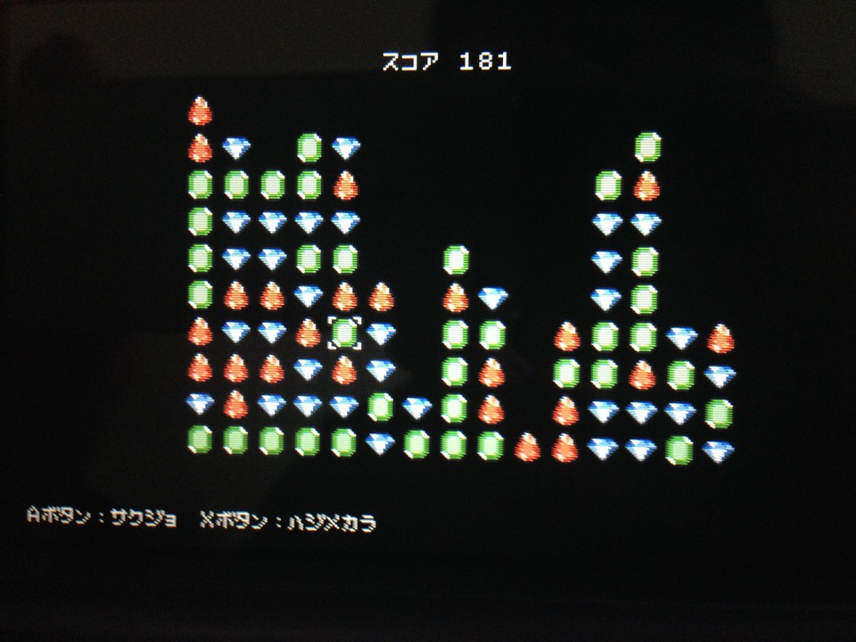

Petitcon-SameGame
=================

ニンテンドー3DSのプチコン3号でさめがめを作ります。

なお、[Newral技術者ブログ](http://newral.info/publics/index/79/&anchor_link=page79_341#page79_341)というサイトでプログラミングの過程を記事にしております。是非ご覧下さい。  

###記事へのリンク

[プチコン3号(BASIC)でさめがめ(Part1)](http://newral.info/publics/index/79/r_id=252/c_id=341/detail=1/&anchor_link=page79_341_252#page79_341_252)  
[プチコン3号(BASIC)でさめがめ(Part2)](http://newral.info/publics/index/79/r_id=254/c_id=341/detail=1/&anchor_link=page79_341_254#page79_341_254)  
[プチコン3号(BASIC)でさめがめ(Part3)](http://newral.info/publics/index/79/r_id=255/c_id=341/detail=1/&anchor_link=page79_341_255#page79_341_255)  

###ソースコードガイド

SameGame_part1.bas (Part1でプログラミングしたソースコード)  
SameGame_part2.bas (Part2でプログラミングしたソースコード)  
SameGame_part3.bas (Part3でプログラミングしたソースコード)  

***Part3でさめがめ完成!!***  

###動作確認環境

プチコン3号SMILE BASIC Version 3.1.0

さめがめプログラム公開キー ***4ENX3VHV***
